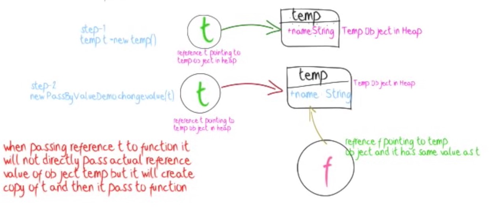
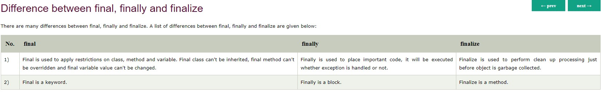
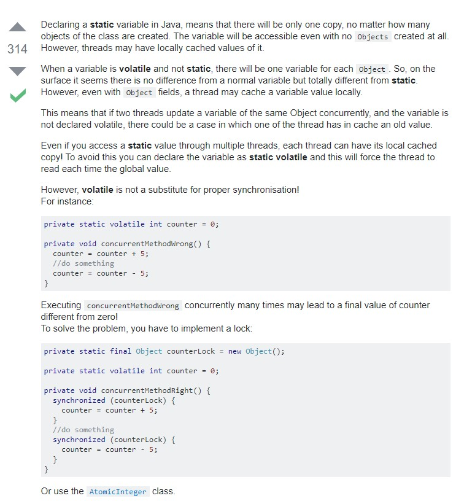

# Notes

## Pass By Value

Java is always pass by value, with no exceptions, ever.

Java passes references by value




## Access Modifiers


## Final Fianlly and Finailize



**Does a finally block always run?**

If the JVM exits while the try or catch code is being executed, then the finally block may not execute. Likewise, if the thread executing the try or catch code is interrupted or killed, the finally block may not execute even though the application as a whole continues.

## Override Vs Overload


## Interface Vs Abstract


## Exceptions

**What are checked exceptions?**

Checked exceptions are checked at compile-time.
It means if a method is throwing a checked exception then it should handle the exception using try-catch block or it should declare the exception using throws keyword, otherwise the program will give a compilation error.
Lets understand this with the help of an example:

- SQLException
- IOException
- ClassNotFoundException
- InvocationTargetException

**What are Unchecked exceptions?**


Unchecked exceptions are not checked at compile time.
It means if your program is throwing an unchecked exception and even if you didn’t handle/declare that exception, the program won’t give a compilation error.
Most of the times these exception occurs due to the bad data provided by user during the user-program interaction.
It is up to the programmer to judge the conditions in advance, that can cause such exceptions and handle them appropriately. All Unchecked exceptions are direct sub classes of RuntimeException class.

- NullPointerException
- ArrayIndexOutOfBoundsException
- ArithmeticException
- IllegalArgumentException
- NumberFormatException

## Map and Collection


### SET vs LIST


- <http://www.java67.com/2013/06/how-get-method-of-hashmap-or-hashtable-works-internally.html>

## Thread

**What is the difference between Process and Thread?**

A process is a self contained execution environment and it can be seen as a program or application whereas Thread is a single task of execution within the process. Java runtime environment runs as a single process which contains different classes and programs as processes. Thread can be called lightweight process. Thread requires less resources to create and exists in the process, thread shares the process resources.

**Static VS Volatile ???**

Difference Between Static and Volatile :

**Static Variable:** If two Threads(suppose t1 and t2) are accessing the same object and updating a variable which is declared as static then it means t1 and t2 can make their own local copy of the same object(including static variables) in their respective cache,so update made by t1 to the static variable in its local cache wont reflect in the static variable for t2 cache .

Static variables are used in the context of Object where update made by one object would reflect in all the other objects of the same class but not in the context of Thread where update of one thread to the static variable will reflect the changes immediately to all the threads (in their local cache).

**Volatile variable:** If two Threads(suppose t1 and t2) are accessing the same object and updating a variable which is declared as volatile then it means t1 and t2 can make their own local cache of the Object except the variable which is declared as a volatile . So the volatile variable will have only one main copy which will be updated by different threads and update made by one thread to the volatile variable will immediately reflect to the other Thread.

**static variables may be cached for individual threads. In multi threaded environment if one thread modifies it's cached data, that may not reflect for other threads as they have a copy of it.
volatile declaration makes sure that threads won't cache the data and uses the shared copy only.**



**What are Some Tips Avoid Locks ???**

- Don't use locks.
- If you must, keep your locks local. Global locks can be really tricky.
- Do as little as possible when you hold the lock.
- Prefer Immutable types. Many times this means copying data instead of sharing data.
- Use compare and set (CAS) mechanics instead, See AtomicReference for example.

<https://stackoverflow.com/questions/224868/easy-simple-to-use-lru-cache-in-java>

```java
ConcurrentMap<K, V> cache = new ConcurrentLinkedHashMap.Builder<K, V>()
    .maximumWeightedCapacity(1000)
    .build();
```

## Adavnce JVM Questions

<https://stackoverflow.com/questions/41358895/permgen-is-part-of-heap-or-not>
<https://www.journaldev.com/4098/java-heap-space-vs-stack-memory>

### Java Heap Space

Java Heap space is used by java runtime to allocate memory to Objects and JRE classes. Whenever we create any object,it’s always created in the Heap space.

Garbage Collection runs on the heap memory to free the memory used by objects that doesn’t have any reference. Any object created in the heap space has global access and can be referenced from anywhere of the application.

### Java Stack Memory

Java Stack memory is used for execution of a thread. They contain method specific values that are short-lived and references to other objects in the heap that are getting referred from the method.

Stack memory is always referenced in LIFO (Last-In-First-Out) order. Whenever a method is invoked, a new block is created in the stack memory for the method to hold local primitive values and reference to other objects in the method.

As soon as method ends, the block becomes unused and become available for next method.
Stack memory size is very less compared to Heap memory.

### Difference between Java Heap Space and Stack Memory

Based on the above explanations, we can easily conclude following differences between Heap and Stack memory.

- Heap memory is used by all the parts of the application whereas stack memory is used only by one thread of execution.
- Whenever an object is created, it’s always stored in the Heap space and stack memory contains the reference to it. Stack memory only contains local primitive variables and reference variables to objects in heap space.
- Objects stored in the heap are globally accessible whereas stack memory can’t be accessed by other threads.
- Memory management in stack is done in LIFO manner whereas it’s more complex in Heap memory because it’s used globally. Heap memory is divided into Young-Generation, Old-Generation etc, more details at Java Garbage Collection.
- Stack memory is short-lived whereas heap memory lives from the start till the end of application execution.
- We can use -Xms and -Xmx JVM option to define the startup size and maximum size of heap memory. We can use -Xss to define the stack memory size.
- When stack memory is full, Java runtime throws java.lang.StackOverFlowError whereas if heap memory is full, it throws java.lang.OutOfMemoryError: Java Heap Space error.
- Stack memory size is very less when compared to Heap memory. Because of simplicity in memory allocation (LIFO), stack memory is very fast when compared to heap memory.

## Heap and Stack Memory in Java Program

Let’s understand the Heap and Stack memory usage with a simple program.

```java
package com.journaldev.test;

public class Memory {

	public static void main(String[] args) { // Line 1
		int i=1; // Line 2
		Object obj = new Object(); // Line 3
		Memory mem = new Memory(); // Line 4
		mem.foo(obj); // Line 5
	} // Line 9

	private void foo(Object param) { // Line 6
		String str = param.toString(); //// Line 7
		System.out.println(str);
	} // Line 8

}
```

Below image shows the Stack and Heap memory with reference to above program and how they are being used to store primitive, Objects and reference variables.


#### java memory management, java heap space, heap vs stack, java heap, stack vs heap

Let’s go through the steps of execution of the program.

- As soon as we run the program, it loads all the Runtime classes into the Heap space. When main() method is found at line 1, Java Runtime creates stack memory to be used by main() method thread.
- We are creating primitive local variable at line 2, so it’s created and stored in the stack memory of main() method.
- Since we are creating an Object in line 3, it’s created in Heap memory and stack memory contains the reference for it. Similar process occurs when we create Memory object in line 4.
- Now when we call foo() method in line 5, a block in the top of the stack is created to be used by foo() method. Since Java is pass by value, a new reference to Object is created in the foo() stack block in line 6.
- A string is created in line 7, it goes in the String Pool in the heap space and a reference is created in the foo() stack space for it.
- foo() method is terminated in line 8, at this time memory block allocated for foo() in stack becomes free.
- In line 9, main() method terminates and the stack memory created for main() method is destroyed. Also the program ends at this line, hence Java Runtime frees all the memory and end the execution of the program.

## Terms

- SOA  : Service Oriented Architecture
- SaaS : Software As a Service
- Paas : Platform As Service

## MY WORKS

- <http://www.dabhand.org/ECL/construct_a_simple_bible_search.htm>
- Metrics and vizualization