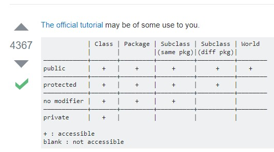
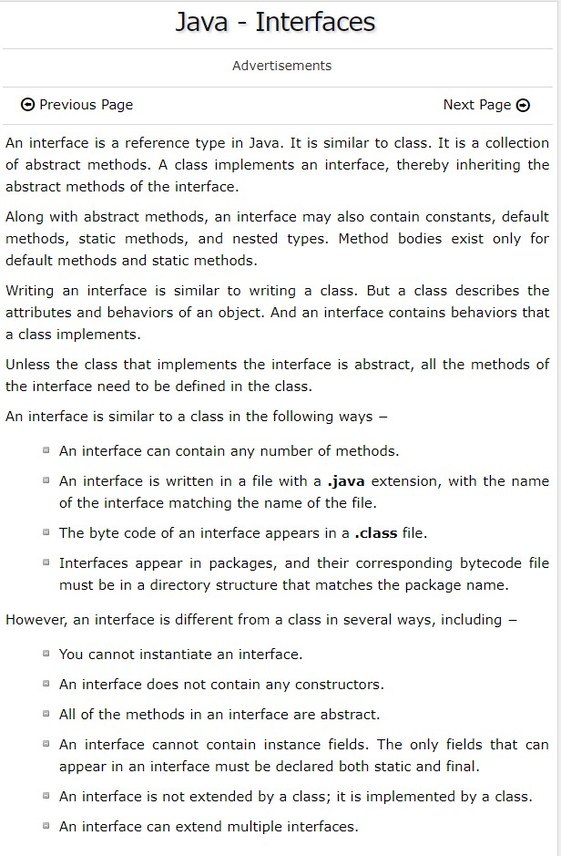

# Notes

## Pass By Value

Java is always pass by value, with no exceptions, ever.

Java passes references by value

## Access Modifiers

## Final Fianlly and Finailize

**Does a finally block always run?**

If the JVM exits while the try or catch code is being executed, then the finally block may not execute. Likewise, if the thread executing the try or catch code is interrupted or killed, the finally block may not execute even though the application as a whole continues.

## Override Vs Overload

## Interface Vs Abstract

## Exceptions

**What are checked exceptions?**

Checked exceptions are checked at compile-time.
It means if a method is throwing a checked exception then it should handle the exception using try-catch block or it should declare the exception using throws keyword, otherwise the program will give a compilation error.
Lets understand this with the help of an example:

- SQLException
- IOException
- ClassNotFoundException
- InvocationTargetException

**What are Unchecked exceptions?**

Unchecked exceptions are not checked at compile time.
It means if your program is throwing an unchecked exception and even if you didn’t handle/declare that exception, the program won’t give a compilation error.
Most of the times these exception occurs due to the bad data provided by user during the user-program interaction.
It is up to the programmer to judge the conditions in advance, that can cause such exceptions and handle them appropriately. All Unchecked exceptions are direct sub classes of RuntimeException class.

- NullPointerException
- ArrayIndexOutOfBoundsException
- ArithmeticException
- IllegalArgumentException
- NumberFormatException

## Terms

- SOA  : Service Oriented Architecture
- SaaS : Software As a Service
- Paas : Platform As Service

## MY WORKS

- <http://www.dabhand.org/ECL/construct_a_simple_bible_search.htm>
- Metrics and vizualization