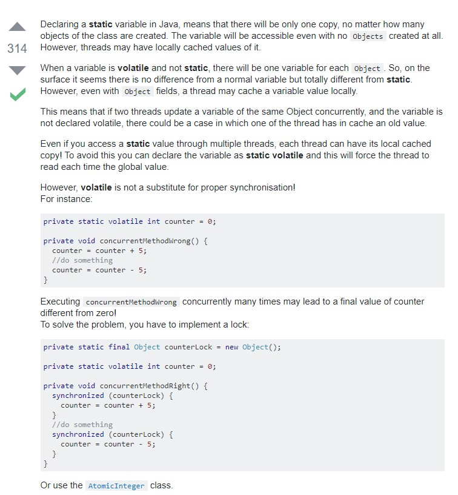

# Thread

**What is the difference between Process and Thread?**

A process is a self contained execution environment and it can be seen as a program or application whereas Thread is a single task of execution within the process. Java runtime environment runs as a single process which contains different classes and programs as processes. Thread can be called lightweight process. Thread requires less resources to create and exists in the process, thread shares the process resources.

**Static VS Volatile ???**

Difference Between Static and Volatile :

**Static Variable:** If two Threads(suppose t1 and t2) are accessing the same object and updating a variable which is declared as static then it means t1 and t2 can make their own local copy of the same object(including static variables) in their respective cache,so update made by t1 to the static variable in its local cache wont reflect in the static variable for t2 cache .

Static variables are used in the context of Object where update made by one object would reflect in all the other objects of the same class but not in the context of Thread where update of one thread to the static variable will reflect the changes immediately to all the threads (in their local cache).

**Volatile variable:** If two Threads(suppose t1 and t2) are accessing the same object and updating a variable which is declared as volatile then it means t1 and t2 can make their own local cache of the Object except the variable which is declared as a volatile . So the volatile variable will have only one main copy which will be updated by different threads and update made by one thread to the volatile variable will immediately reflect to the other Thread.

**static variables may be cached for individual threads. In multi threaded environment if one thread modifies it's cached data, that may not reflect for other threads as they have a copy of it.
volatile declaration makes sure that threads won't cache the data and uses the shared copy only.**



**What are Some Tips Avoid Locks ???**

- Don't use locks.
- If you must, keep your locks local. Global locks can be really tricky.
- Do as little as possible when you hold the lock.
- Prefer Immutable types. Many times this means copying data instead of sharing data.
- Use compare and set (CAS) mechanics instead, See AtomicReference for example.

<https://stackoverflow.com/questions/224868/easy-simple-to-use-lru-cache-in-java>

```java
ConcurrentMap<K, V> cache = new ConcurrentLinkedHashMap.Builder<K, V>()
    .maximumWeightedCapacity(1000)
    .build();
```