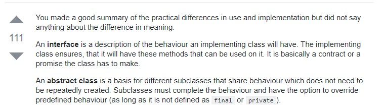

# Notes

## Pass By Value

Java is always pass by value, with no exceptions, ever.

Java passes references by value

## Access Modifiers

## Final Fianlly and Finailize

**Does a finally block always run?**

If the JVM exits while the try or catch code is being executed, then the finally block may not execute. Likewise, if the thread executing the try or catch code is interrupted or killed, the finally block may not execute even though the application as a whole continues.

## Override Vs Overload

## Interface Vs Abstract

## Exceptions

**What are checked exceptions?**

Checked exceptions are checked at compile-time.
It means if a method is throwing a checked exception then it should handle the exception using try-catch block or it should declare the exception using throws keyword, otherwise the program will give a compilation error.
Lets understand this with the help of an example:

- SQLException
- IOException
- ClassNotFoundException
- InvocationTargetException

**What are Unchecked exceptions?**

Unchecked exceptions are not checked at compile time.
It means if your program is throwing an unchecked exception and even if you didn’t handle/declare that exception, the program won’t give a compilation error.
Most of the times these exception occurs due to the bad data provided by user during the user-program interaction.
It is up to the programmer to judge the conditions in advance, that can cause such exceptions and handle them appropriately. All Unchecked exceptions are direct sub classes of RuntimeException class.

- NullPointerException
- ArrayIndexOutOfBoundsException
- ArithmeticException
- IllegalArgumentException
- NumberFormatException

## Map and Collection

### SET vs LIST

- <http://www.java67.com/2013/06/how-get-method-of-hashmap-or-hashtable-works-internally.html>

## Thread

**What is the difference between Process and Thread?**

A process is a self contained execution environment and it can be seen as a program or application whereas Thread is a single task of execution within the process. Java runtime environment runs as a single process which contains different classes and programs as processes. Thread can be called lightweight process. Thread requires less resources to create and exists in the process, thread shares the process resources.

**Static VS Volatile ???**

Difference Between Static and Volatile :

**Static Variable:** If two Threads(suppose t1 and t2) are accessing the same object and updating a variable which is declared as static then it means t1 and t2 can make their own local copy of the same object(including static variables) in their respective cache,so update made by t1 to the static variable in its local cache wont reflect in the static variable for t2 cache .

Static variables are used in the context of Object where update made by one object would reflect in all the other objects of the same class but not in the context of Thread where update of one thread to the static variable will reflect the changes immediately to all the threads (in their local cache).

**Volatile variable:** If two Threads(suppose t1 and t2) are accessing the same object and updating a variable which is declared as volatile then it means t1 and t2 can make their own local cache of the Object except the variable which is declared as a volatile . So the volatile variable will have only one main copy which will be updated by different threads and update made by one thread to the volatile variable will immediately reflect to the other Thread.

**static variables may be cached for individual threads. In multi threaded environment if one thread modifies it's cached data, that may not reflect for other threads as they have a copy of it.
volatile declaration makes sure that threads won't cache the data and uses the shared copy only.**

**What are Some Tips Avoid Locks ???**

- Don't use locks.
- If you must, keep your locks local. Global locks can be really tricky.
- Do as little as possible when you hold the lock.
- Prefer Immutable types. Many times this means copying data instead of sharing data.
- Use compare and set (CAS) mechanics instead, See AtomicReference for example.

## Terms

- SOA  : Service Oriented Architecture
- SaaS : Software As a Service
- Paas : Platform As Service

## MY WORKS

- <http://www.dabhand.org/ECL/construct_a_simple_bible_search.htm>
- Metrics and vizualization